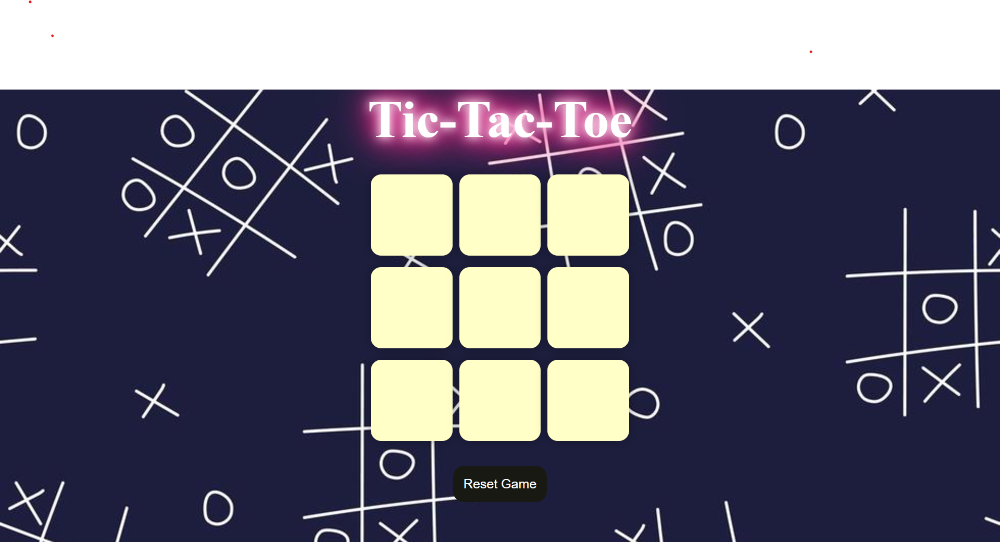

🎮 Tic-Tac-Toe Game

A dynamic, fun-filled implementation of the classic Tic-Tac-Toe game enhanced with interactive sound effects and smooth design! This project is built using HTML, CSS, and JavaScript to provide an engaging gaming experience.

📜 Overview

This Tic-Tac-Toe game lets two players compete on a 3x3 grid with the added charm of sound effects for every action, including marking X or O, and results like winning, losing, or a tie.

The user-friendly interface, coupled with background music, ensures a delightful experience.

🌟 Features

•	Two-Player Gameplay: Play as X or O and take turns marking the grid.

•	Sound Effects:

                       Background music for a fun atmosphere 🎵.
                       
                       Unique sounds for placing marks, winning, losing, or tying. 🎶
                       
•	Responsive Design: Enjoy the game on any device—desktop or mobile.

•	Game Reset: Start fresh with the click of a button.

•	Winner Announcement: Clear display of results for each round.

🛠️ Setup
Prerequisites
•	A modern web browser 🌐

•	Speakers or headphones for sound effects 🎧

•	Files

i.	HTML File (index.html): Defines the game structure. 🏗️

ii.	CSS File (styles.css): Provides styling for the layout and responsiveness. 🎨

iii.	JavaScript File (script.js): Handles game logic, sound effects, and interactivity. 📜

•	Sound Assets: Audio files for background music and game effects. 🎵

🚀 Getting Started
Clone the Repository:

bash
Copy code
git clone https://github.com/pragti-124/Tic-Tac-Toe.git

Navigate to the Project Directory:

bash

Copy code

cd <Tic-Tac-Toe>

Open the Game:

Open index.html in any modern web browser to play.

⚙️ Functionality
Game Flow:

1.	Players take turns placing X or O on the grid.
2.	The game announces the winner or a tie when applicable.
3.	Sound Effects:
                Background music plays continuously while the game is open.
                Placing marks triggers distinct sounds for X and O.
                Winning, losing, and tying have unique celebratory or neutral sounds.
4.	Responsive Design:
                The layout adjusts to various screen sizes for seamless gameplay on mobile devices.

5.	Reset Game:
                 Restart the game anytime by clicking the reset button.

📝 Code Details

•	HTML Structure:
Layout includes a 3x3 grid, buttons for reset, and a result display area.

•	CSS Styles:
Grid Styling: Clean, centered gameboard with a modern look.
Responsiveness: Adaptable design for different screen sizes.

•	JavaScript Logic:
Game Logic: Manages turns, checks for winning combinations, and determines ties.
Audio Management: Loads and plays sound files based on user actions.

🎮 How to Play
1.	Launch the game in your browser.
2.	Player 1 starts as X, and Player 2 is O.
3.	Take turns clicking on grid cells to place your mark.
4.	The game ends when one player wins or all cells are filled (tie).
5.	Click "Reset" to play again!

🤝 Contribution
Contributions are welcome! Feel free to:
Submit bug reports or suggestions via the Issues tab.
Fork the repository and create a pull request for new features.

📄 License
This project is licensed under the MIT License.

📸 Screenshots
Here are a few snapshots of the game in action:

🎮 Gameboard:

